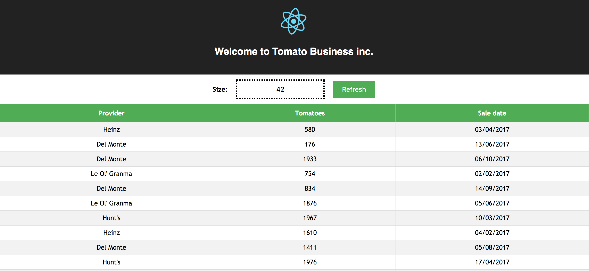

# Tomato-business

Steps to run:
+ Build && run backend app - `cd tomato-backend && mvn clean install && java -jar target/*.jar`  
+ Run frontend - `cd tomato-frontend && npm start`

Open [App page](http://localhost:3000) here u go! 

